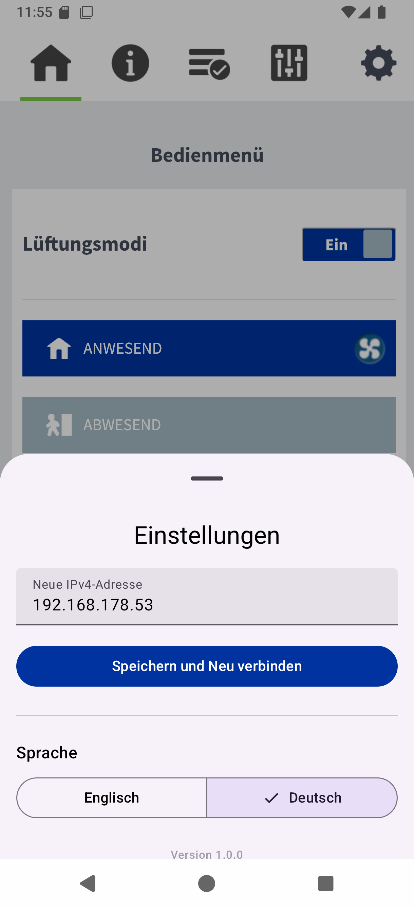

# ValloView - Android app

ValloView is an open-source Android application that embeds a remote Vallox dashboard inside a Compose-based WebView interface. It provides a minimal setup flow for configuring the target service address, verifies the remote service availability, and displays the dashboard directly within the app.

<figure>
  
  <figcaption>Screenshot: ValloView displaying the remote Vallox dashboard in an embedded WebView with the settings sheet open. The screenshot shows the app's current IP configuration screen, the language selector, and a polished Material 3 interface.</figcaption>
</figure>

## Features

- Single-screen Compose UI with modern Material 3 styling
- Service endpoint configuration and persistent storage using Android DataStore
- Remote service verification using HTTP checks and content validation
- Embedded WebView for displaying the Vallox dashboard
- Settings sheet for updating the target IP address, changing language, and viewing version information

## Project Structure

- `app/src/main/java/de/codingsolutions/valloview`
  - `MainActivity.kt`: Application entry point and main Compose screen logic
- `app/src/main/java/de/codingsolutions/valloview/data`
  - `SettingsRepository.kt`: DataStore-based persistence for the configured service address
- `app/src/main/java/de/codingsolutions/valloview/ui/theme`
  - `Theme.kt`, `Color.kt`, `Type.kt`: App theme, color scheme, and typography definitions
- `app/src/main/java/de/codingsolutions/valloview/util`
  - `ServiceVerifier.kt`: Remote service validation and IP address utilities

## Getting Started

### Prerequisites

- Android Studio Flamingo or later
- JDK 17 or compatible Java Development Kit
- Gradle wrapper included in the repository (`gradle-9.4.1`)
- Android SDK platforms and build tools for `compileSdk 37`
- `minSdk 24`, `targetSdk 37`
- Kotlin `2.4.0` and Android Gradle Plugin `9.2.1`

### Clone the repository

1. Clone the repository:

   ```bash
   git clone https://github.com/chrisneukam/android-ValloView-app.git
   cd android-ValloView-app
   ```

2. Open the project in Android Studio or VS Code.
   - In Android Studio, import the Gradle project and run a Gradle sync.
   - In VS Code, open the repository folder and install Android/Kotlin extensions if needed.

### Build and run locally

1. Open a terminal in the project root.
2. Build the debug variant:

   ```bash
   ./gradlew build
   ```

   On Windows you can use:

   ```bash
   gradlew.bat build
   ```

3. Start an Android emulator or connect a physical device.
4. Install and run the app:

   ```bash
   ./gradlew installDebug
   ```

5. Alternatively, use Android Studio to run the `app` configuration directly.

### Generate Dokka Documentation

To generate the module documentation, run:

```bash
./gradlew :app:dokkaGenerate
```

## Development Workflow

When working in Visual Studio Code, the repository includes several useful tasks for common development workflows:

- **Gradle Build**: runs the Gradle wrapper to build the app and verify the project configuration.
- **Format with ktlint**: formats Kotlin source files using the configured ktlint rules.
- **Execute Unit Tests**: run the available unti tests verifiying the correct bahavior of the single software units.
- **Generate Dokka docs**: generates the Dokka documentation output for the app module.
- **Dokka: Serve Docs**: starts a lightweight local HTTP server so the generated Dokka HTML documentation can be viewed in a browser.

These tasks can be executed from the VS Code command palette or the built-in Tasks panel, providing a quick way to validate changes and keep the project consistent.

### Using the VS Code tasks for Dokka documentation

1. Run the VS Code task **Generate Dokka docs**. This executes Gradle and creates the documentation under `app/build/dokka/html`.
2. After generation completes, run the VS Code task **Dokka: Serve Docs**. This starts a local HTTP server on port `8000`.
3. Open your browser and go to:

   [http://localhost:8000/app/build/dokka/html/index.html](http://localhost:8000/app/build/dokka/html/index.html)

This loads the generated ValloView documentation from the local server.

### Alternative: Dokka in Android Studio

If you prefer Android Studio, you can also generate the documentation from the Gradle tool window:

1. Open the Gradle view in Android Studio.
2. Find the `:app` module tasks and run `dokkaGenerate`.
3. After the task finishes, open the generated HTML file from `app/build/dokka/html/index.html` in your browser.

This is the same documentation output as the VS Code task, but launched directly from Android Studio.

## Usage

1. Start the app.
2. Enter the target Vallox service IP address.
3. Save the address and allow the app to verify the service.
4. Once verified, the remote Vallox dashboard is loaded inside the embedded WebView.

## License

This library is released under the Apache V2.0 License. See LICENSE for more information.

Please let me know if you have any questions or feedback. I'm happy to help! 😊
